# Introduction To C


## Hello World

```c
#include <stdio.h>
int main() {
    printf("Hello World!");
}
```

This is Hello World Program

-----------------------------------------------------------------------------

*Notes From Lec 1 -11 on Copy*

---------------------------------------

## Lec 12 How to use gotoxy function in code blocks

- gotoxy is a pre-defined function 
  
  - COORD is  a DataType
    
    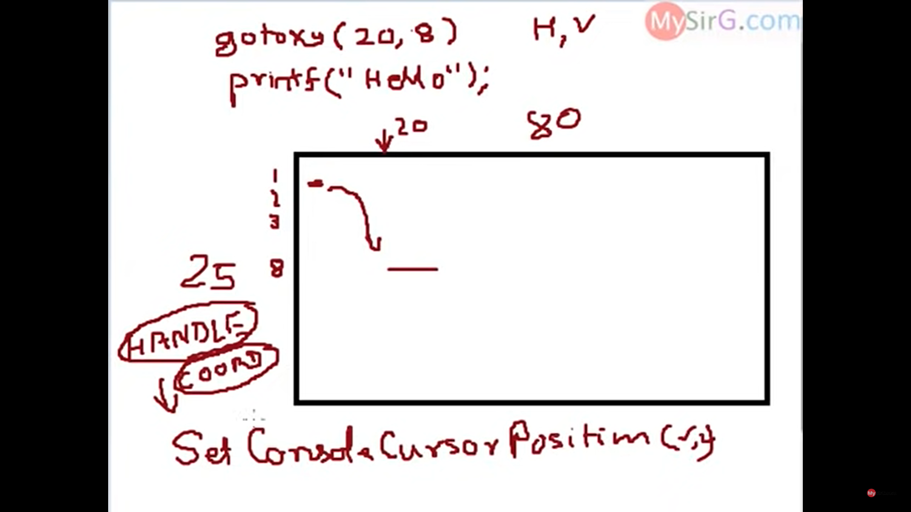
    
    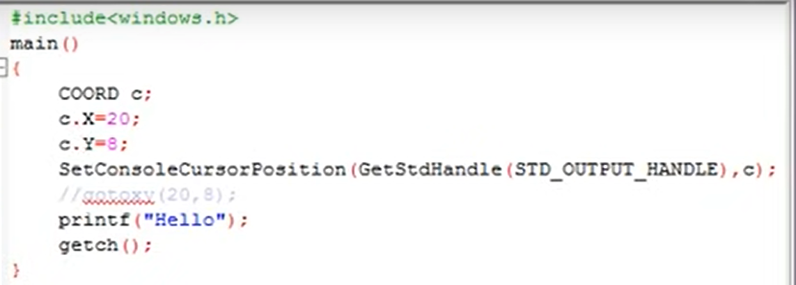
  
  ```c
  // gotoxy is only valid for Turbo C
  
  
  ```

(OR)

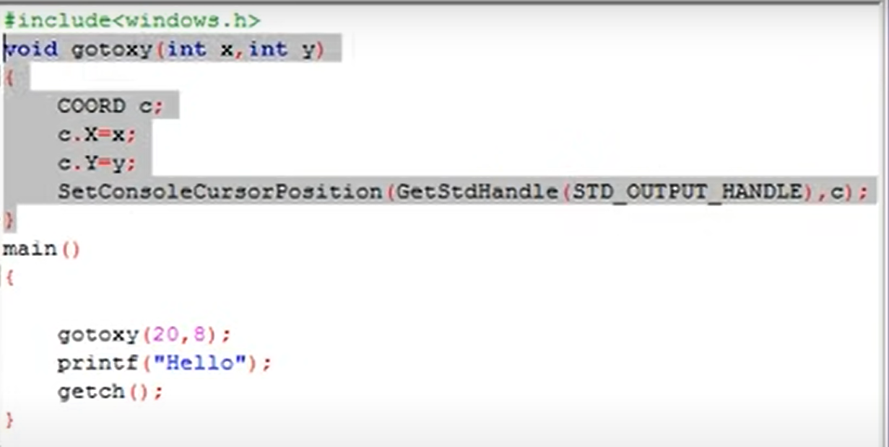


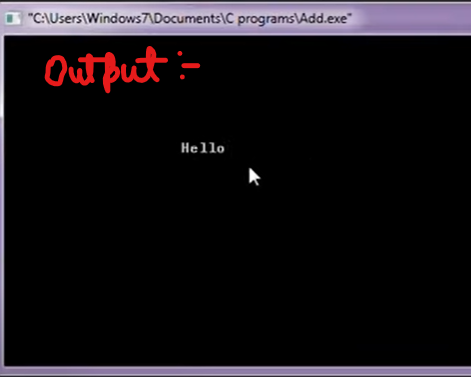

EXTRA:-

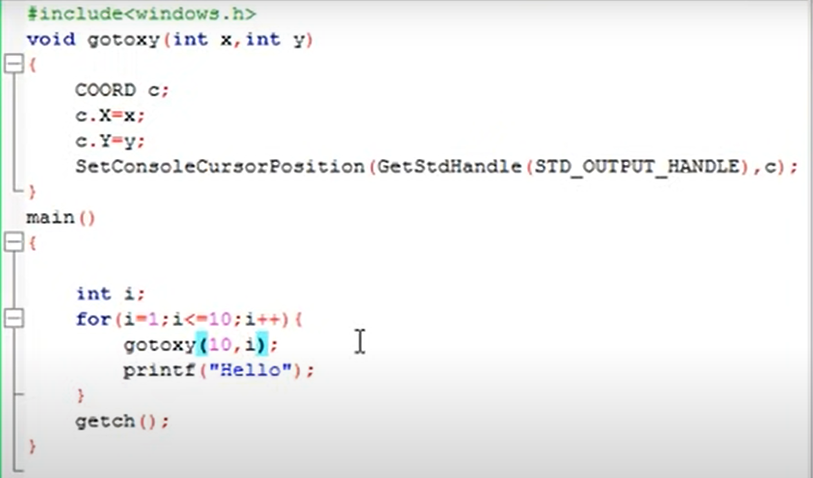

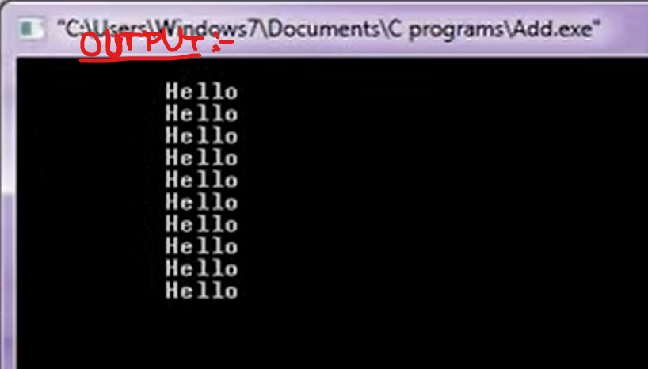

---------------------

## Lec 13 - ASCII Codes

ASCII stands for:
American Standard Code for Information Interchange

- There are 256 ASCII codes are present

- There are 128 Standard ASCII codes (i.e. 0-127) and the left 128 codes are Extended ASCII codes (i.e. 128-255)


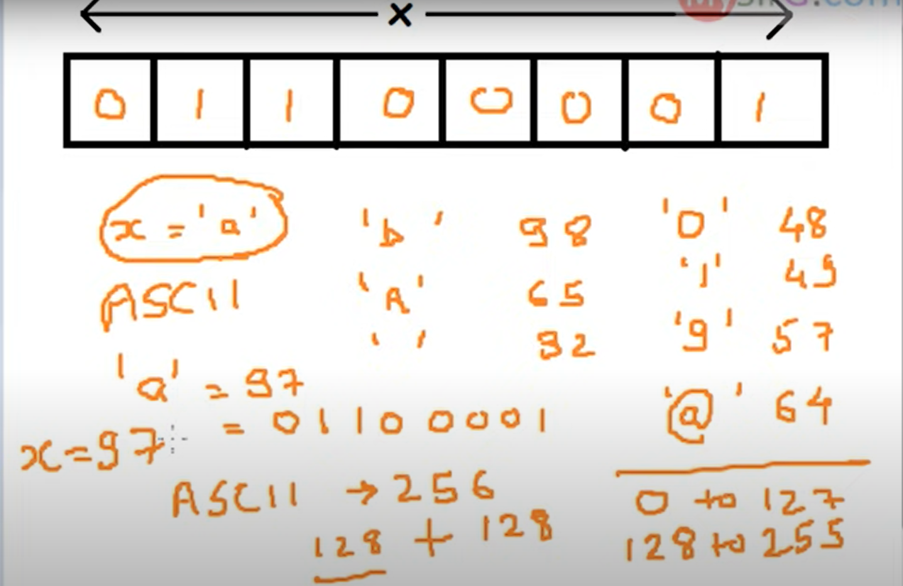


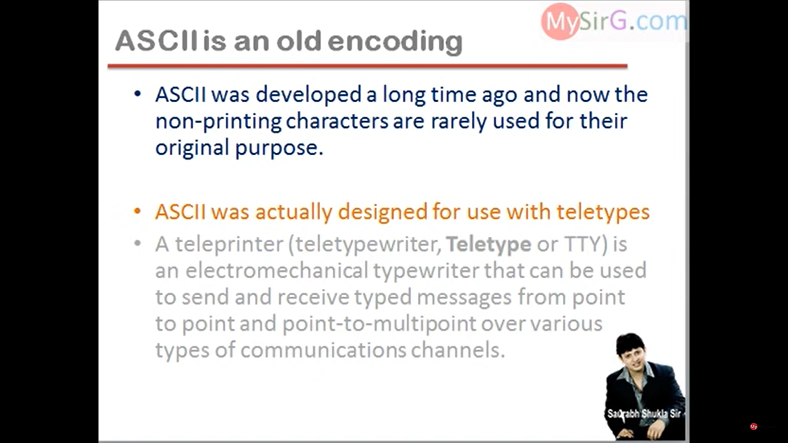


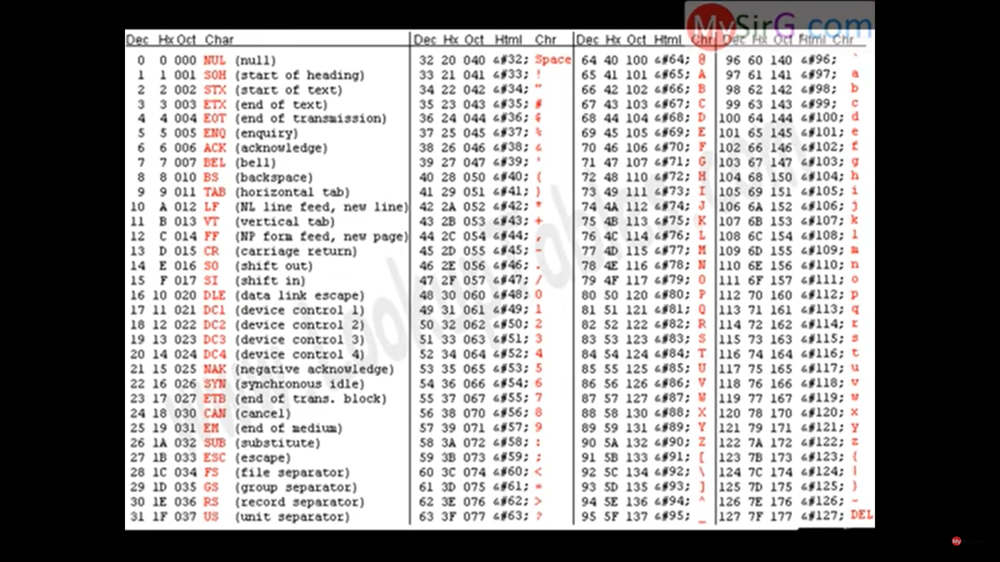


**Extended ASCII Codes:**

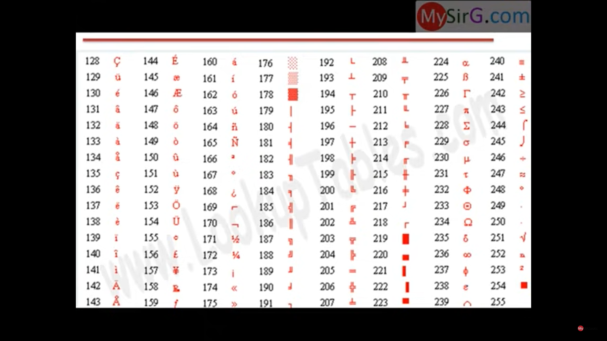


----------------------------------------------------------------------------------------

## Lec 14 - Arithmetic Instruction in C (Part -1 )

**NOTE:** There is no BODMAS in "C" language

-------------------

## Lec 15 - Arithmetic Instruction in C (P-2)

**OPERATOR GROUPS:**

- Unary Operators

- Arithmetic Operators

- Bitwise Operators

- Relational Operators

- Logical Operators

- Conditional Operator

- Assignment Operators

**UNARY OPERATORS:**

Here Only one operand is required

- +,-,++,--,sizeof()

        Binary Operator:  Operators required two operands...    

        TERNIARY OPERATOR: Operators required Three operands

// Use of x++, ++x

```c
// ++ increment operator
main()
{
int x=3;
clrscr();
x++; //x=x+1 Post increment
printf("%d",x);
++x; //x=x+1 Pre increment
printf("%d",x);
getch();
}
```

// Use of  x-- , --x

```c
// -- decrement operator
main()
{
int x=3;
clrscr();
x--; //x=x-1  Post decrement
printf("%d",x);
--x; //x=x-1  Pre decrement
printf("%d",x);
getch();
}
```

---------------------------

## Lec 16 Arithmetic Instruction in C (P-3)

**sizeof()**: It's an operator which tells the size (Unit: bytes)

- sizeof(data type)

- sizeof(variable)

- sizeof(constant)

e.g.: Size of float => 4 bytes

```c
// sizeof()
main()
{
int x;
clrscr();
x=sizeof(float);
// x=sizeof(double);
// x=sizeof(char);
// x=sizeof(int);
printf("%d",x);
getch();
}
```

```c
// Sizeof()
main()
{
int x,y;
float k;
double d1;
char ch;
clrscr();
x=sizeof(ch);
// x=sizeof(y);
// x=sizeof(d1);
// x=sizeof(k);

printf("%d",x);
getch();
}
```

```c
// sizeof()
main()
{

int x,y,z;
clrscr();
x=sizeof(34);
y=sizeof(3.56);
z=sizeof(‘a');
printf("%d %d %d",x,y,z);
getch();
}
```

```c
// sizeof() (CORRECT ONE)
#include <stdio.h>
main()
{

int x,y,z;

x=sizeof(34);   //34 -> Integer
y=sizeof(3.56); //3.56 -> Real constants are type of "double"

z=sizeof('a'); 
/*
ASCII, a -> 97
a -> Character
z=sizeof(97); //97 -> Integer
*/
printf("%d %d %d",x,y,z);
}
```

---------------------------------------

## Lec 17 - Modulus Operator % in C Language:

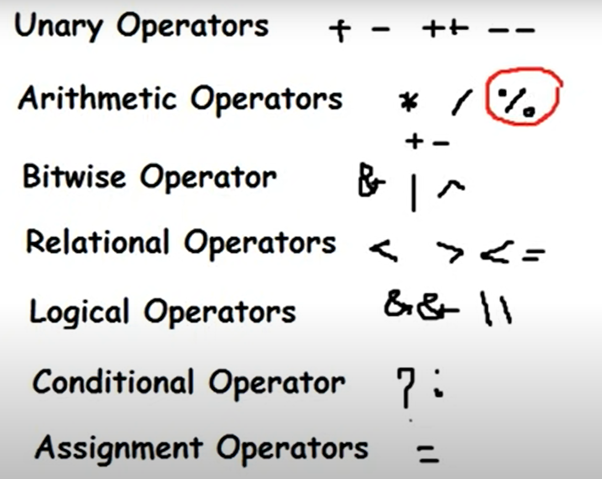


**e.g:**

- 17 % 3 = 2

- 20 % 7 = 6

- 85 % 4 = 1

- 10 % 4 = 2 

- 3 % 4 = 3 

- 25 % 5 = 0  etc...


- 3.5 % 2 = ERROR

**NOTE:** Modulus Operator never works on the Real Constants. Both Operands should be INTEGER.


**Special Example Case (IMPORTANT):**

- 5 % 2 = 1

- -5 % 2 = -1

- 5 % -2 = 1

- -5 % -2 = -1

**Note:**  Sign of the Numerator will be the sign of the RESULT.


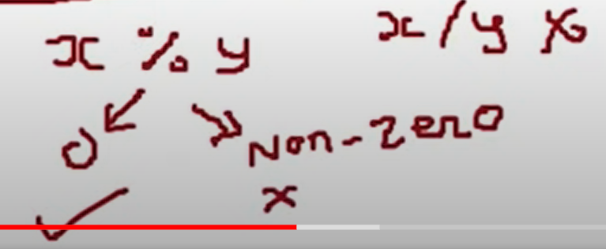

**NOTE:**

- For checking the divisibility of any number use Modulus (%) operator instead of Divisibility (/).

- Divide gives QUOTIENT and Modulus gives REMAINDER....

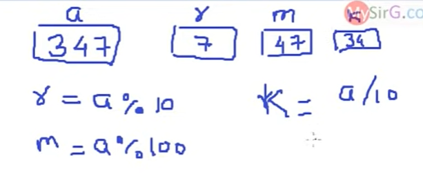


---------------------------------

## Lec 18 Arithmetic Instruction in C (P-4)

**ARITHEMATIC OPERATORS:**

->     *    /    %     (More Priority)

->       +     -


Associativity Rule Left to Right

e.g: 

- 3+4-7    ("+" works first, then "-")

- 3-4+7    ("-" works first, then "+")

```c
// Use of Divide Operator

main()
{
int x;
x=3.0/4;
printf("%d",x);
}

/*
3/4         0
3.0/4       0.75
3/4.0       0.75
3.0/4.0     0.75
*/
```

```c
main()
{
int x;
x = 25%5;
// x = 3/4;
// x = 13/4;
printf("%d",x);
}
```

NOTE: Whenever we need to check whether number is divisible or not from a number use Module operator(%) instead of divide operator(/). 

----------------------------------

## Lec 19 - Bitwise Not Operator in C language

 "Bitwise Not" is a BITWISE OPERATOR as well as UNARY OPERATOR.


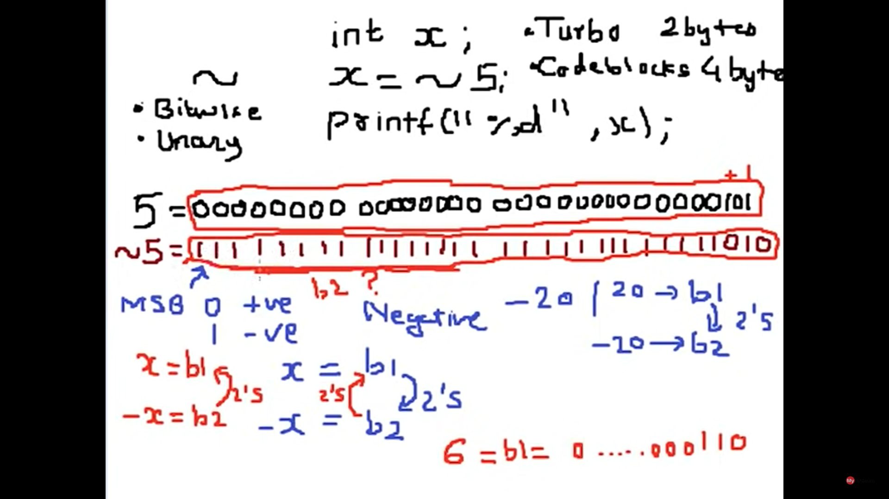

```c
int x;
x = ~5;
printf("%d",x);
```

NOTE: 

- In Turbo, INTEGER tooks 2 Bytes

- In Codeblocks or Visual stdios, INTEGER tooks 4 Bytes


MSB:  Most Significant Bit

- If MSB = 0 then Number is +ve

- If MSB = 1 then Number is -ve


2's -> 2s compliment


5 =  00000000  00000000  00000000  00000101

Convert to 1's compliment by adding +1

i.e.

    =  00000000 00000000 00000000 00000110

--*------------------*

5 = 00000000 00000000 00000000 00000101

~ 5 = 11111111  11111111  11111111  11111010


Another Example:

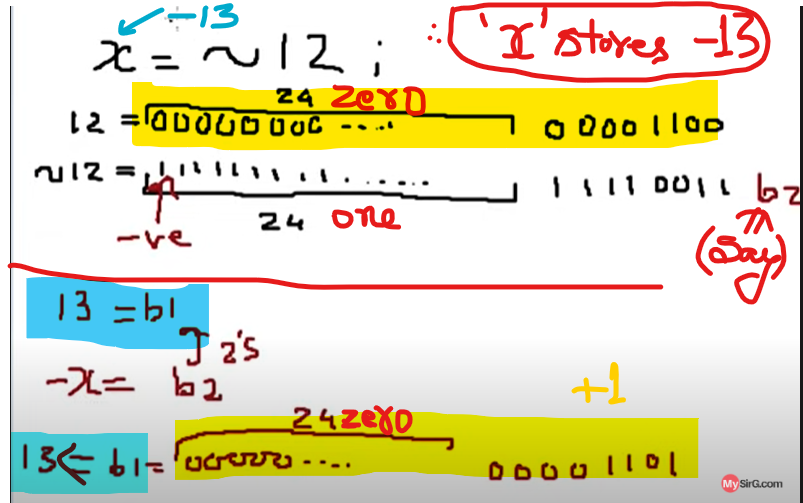


----------------------------------

## Lec 20 - Arithmetic Instruction in C (Part 5)

**<u>BITWISE OPERATORS:</u>**

- Bitwise AND        &

- Bitwise OR           |

- Bitwise XOR         ^

- Bitwise NOT         ~

- Right Shift            >>

- Left Shift              <<


<u>**& Operator**</u>

- 0 & 0 = 0

- 0 & 1 = 0

- 1 & 0 = 0

- 1 & 1 = 1

Note: 0,1 are operands of Bitwise Operator

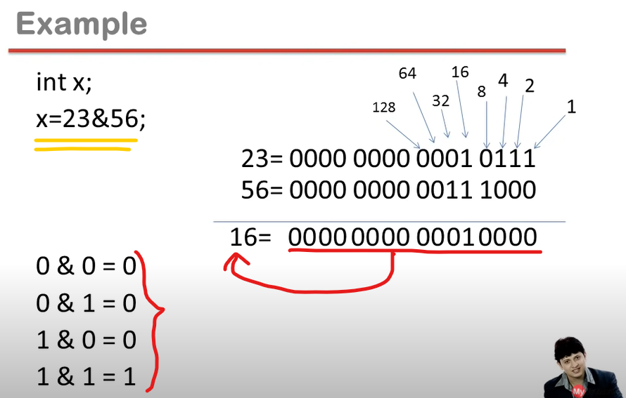

**<u>| Operator</u>**

- 0 | 0 = 0

- 0 | 1 = 1

- 1 | 0 = 1

- 1 | 1 = 1

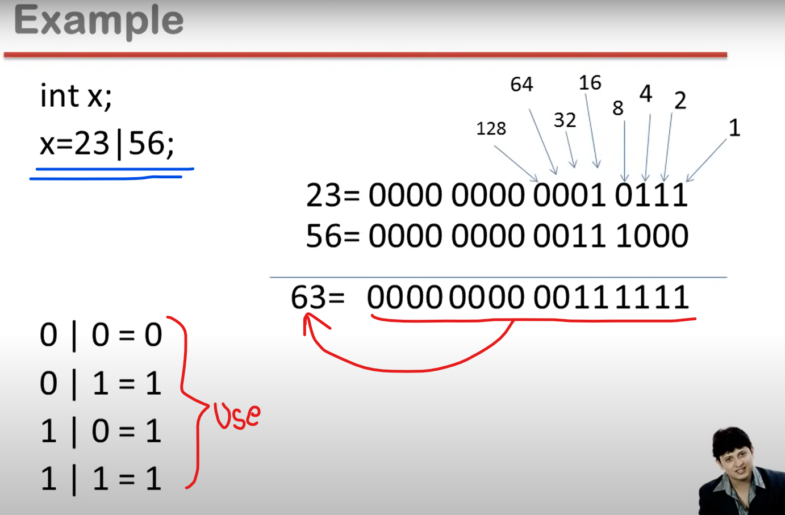

**<u>^ Operator</u>**

- 0 ^ 0 = 0

- 0 ^ 1 = 1

- 1 ^ 0 = 1

- 1 ^ 1 = 0

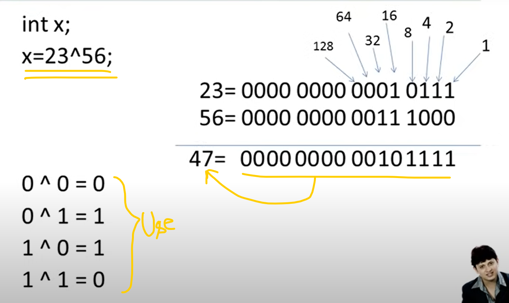

**<u>Right Shift</u>**

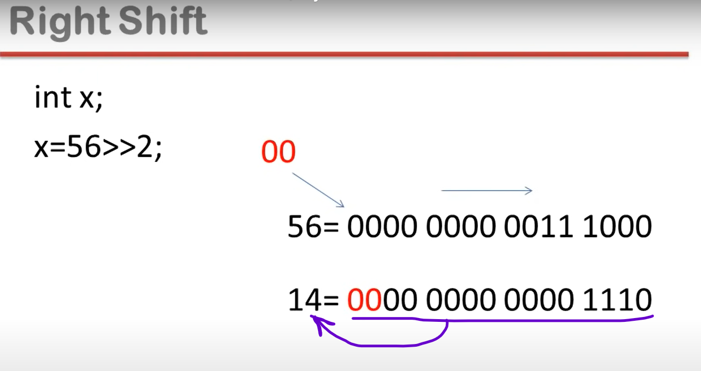

**<u>Left Shift</u>**

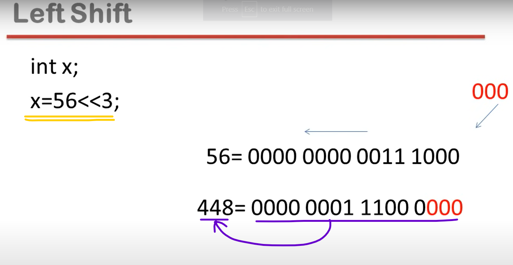

-----------
