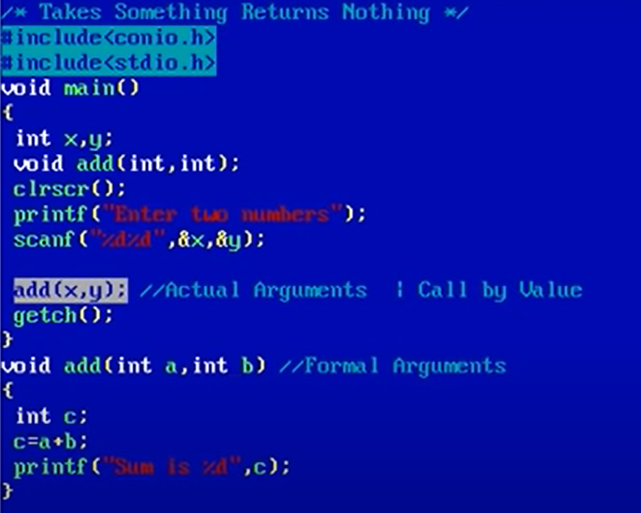
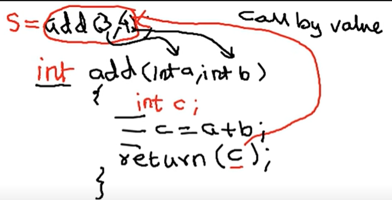

## Lec 21 - Arithmetic Instruction in C (Part - 6)

**<u>Relational Operator</u>**

<, >, <=, >=                    <- (Have More Priority)

==, !=                              <- (Have Less Priority)

<u>Rules:</u>

* Relational operator always yields result either 0 or 1

* Every Non-zero Value is True and Zero is False 

* True is 1 and false is 0

<u>Examples:</u>

```c
#include <stdio.h>
int main(){
    int x;
    x = 3>4;      // Output => 0 
    x = 5>4>3;    // Output => 0
    printf("%d", x);
}
```

---------------------

## Lec 22 - Arithmetic Instruction in C (Part - 7)

**<u>Logical Operators:</u>**

NOT        !

AND        &&

OR           ||

## <u>NOT (!)</u>

* It is also unary operator  (It requires only one oprand to work)

* Priority level is same as of unary operators

* It inverts the truth value of statement

* !T = F

* !F = T

```c
#include <stdio.h>
int main(){
    int y,x=5;
    // y = x>4;               // OUTPUT: 1
    y = !x>4;    // Use of "NOT" operator // OUTPUT: 0
    printf("%d",y);
}
```

## <u>AND (&&)</u>


In case 1: There is no any checking for Statement 2, if once the statement 1 is False in CASE of "&&" operator.

```c
#include <stdio.h>
int main(){
    int y,x=5;
    // y = x>4 && x<10;
    y = x<4 && x<10;
    printf("%d",y);
}
```

## **<u>OR (||)</u>**


```c
#include <stdio.h>
int main(){
    int y,x=5;
    // y = x>4 || x<10;
    y = x<4 || x<10;
    printf("%d",y);
}
```

-------

## Lec 23 - Conditional Operator in C language

**Conditional Operator or Ternary Operator:**

NOTE:

Unary Operator: Need only one Oprand.     e.g: ++x

Binary Operator: Need two Oprands.     e.g: x+y

Ternary / Conditional Operator: Need 3 Oprands. e.g: 


```c
#include <stdio.h>

int main()
{
    int x;
   // x = 5>4?1,2,3:4,5,6;    // Output: 3
   x = 5<4?1,2,3:4,5,6;    // Output: 4

    // NOTE: Always choose which is closer to semicolumn(;)

    printf("%d",x);
    return 0;
}
```

```c
// Using call function
#include <stdio.h>

int fun(){
    return(5>4?5:4);
}
int main(){
    int x;
    x = fun();
    printf("%d",x);
}
```

```c
// Checking the Greatest number...
#include <stdio.h>

int main(){
    int a,b;
    printf("Enter two numbers: ");
    scanf("%d%d",&a,&b);
    printf("Greatest number is %d",a>b?a:b);
    return 0;
}
```

```c
#include <stdio.h>

int main(){
    int x,a=4,b=5;
    a>b?x=a:(x=b);
/* 
NOTE: we need to use brackets() in x=b 
i.e. (x=b) otherrwise it will show error. Compiler will use only
[a>b?x=a:x] =b; Since Conditional Operator(i.e. ? : ) has more priority 
then Assisgnment Operator(i.e. =)
*/
    printf("%d",x);
    return 0;
}
```

---------------

## Lec 24 - Compound Assignment Operators in C

Note: Compound assignment operators has low priority... (Exceptions are there)


e.g: 

x*=3+4     => + operator works first then the Multiply works. Since, Compound assignment operators has low priority.

----------

## Lec 25 - Lecture 6 Decision Control in C (Part - 1)

**<u>CONTROL</u>**


<u>Control Instructions:</u>

* Decision Control Instruction

* Iterative Control Instruction
- Switch Case Control instruction

- goto control Instruction

**<u>Decision / Selection Control Instruction</u>**

* If

* If-else

* Conditional Operator (?:)

## <u>if</u>

```c
// write a program to check whether a number is positive or not

#include <stdio.h>
int main(){
int x;
printf("Enter a number: ");
scanf("%d",&x);
if(x>0){
printf("Positive number");
}
if(x<=0){
printf("Non Positive");
}
return 0;
}
```

-----------------

## Lec 26 - Lecture 6 Decision Control in C (Part - 2)

## <u>if else</u>


```c
// write a program to check whether a number is positive or not

#include <stdio.h>
int main(){
int x;
printf("Enter a number: ");
scanf("%d",&x);
if(x>0){
printf("Positive number");
}
else{
printf("Non Positive");
}
return 0;
}
```

----------------------------

## Lec 27 - Lecture 6 Decision Control in C (Part - 3)

**<u>Conditional Operator ( ?:)       /    Ternary Operator</u>**

## Condition ? Statement: Statement;


```c
// write a program to check whether a number is positive or not

#include <stdio.h>
int main(){
int x;
printf("Enter a number: ");
scanf("%d",&x);

x>0 ? printf("Positive") : printf("Non Positive");

return 0;
}
```

**<u>Selective Assignment:</u>**

## x=a>b ? a: b;

```c
#include <stdio.h>
int main(){
int x, y, max;
printf("Enter two numbers: ");
scanf("%d %d",&x,&y);

max = x>y ? x:y;
printf("Greater number is %d", max);
return 0;
}
```

```c
//Alternative way
#include <stdio.h>
int main(){
int x, y;
printf("Enter two numbers: ");
scanf("%d %d",&x,&y);

printf("Greater number is %d", x>y ? x:y);
return 0;
}
```

----------

## Lec 28 - Nested if else in C language


Example: To find the Greatest number in 3 numbers:


```c
// To find the Greatest number in 3 numbers:

#include <stdio.h>

int main(){
    int a,b,c;
    printf("Enter three numbers: ");
    scanf("%d%d%d", &a,&b,&c);

    if(a>b){
        if(a>c)
            printf("%d",a);
        else
            printf("%d",c);
    }
    else{
        if(b>c)
            printf("%d",b);
        else
            printf("%d",c);
    }
    return 0;
}
```

(OR)

```c
// Using Conditional Operator

#include <stdio.h>

int main(){
    int a,b,c;
    printf("Enter three numbers: ");
    scanf("%d%d%d", &a,&b,&c);

    if(a>b){
        a>c?printf("%d",a):printf("%d",c);
    }
    else{
        b>c?printf("%d",b):printf("%d",c);
    }
    return 0;
}
```

(OR)

```c
// Using Conditional Operator (Simplifying it)

#include <stdio.h>

int main(){
    int a,b,c;
    printf("Enter three numbers: ");
    scanf("%d%d%d", &a,&b,&c);

   a>b?a>c?printf("%d",a):printf("%d",c):b>c?printf("%d",b):printf("%d",c);

    // (a>b)?(a>c)?printf("%d",a):printf("%d",c):(b>c)?printf("%d",b):printf("%d",c);


    return 0;
}
```

(OR)

```c
// Using Conditional Operator (More Simplifying it)
// Nesting in Conditional Operator

#include <stdio.h>

int main(){
    int a,b,c;
    printf("Enter three numbers: ");
    scanf("%d%d%d", &a,&b,&c);

   printf("%d",a>b?a>c?a:c:b>c?b:c);

    return 0;
}
```

-----------

## Lec 29 - if else ladder in C language

NOTE: It is a special case of Nested if-else case


```c
// Program to give Grade

#include <stdio.h>

int main(){
    int marks;
    printf("Enter your marks: ");
    scanf("%d", &marks);
    if(marks>90)
        printf("Grade - A");
    else{
        if(marks>80)
            printf("Grade - B");
        else{
            if(marks>70)
                printf("Grade - C");
            else
            printf("Grade - D");
        }
    }

    return 0;
}
```


(OR) - We are simplifying it...

```c
// Removing Curlie Brackets and Arranging

#include <stdio.h>

int main(){
    int marks;
    printf("Enter your marks: ");
    scanf("%d", &marks);
    if(marks>90)
        printf("Grade - A");
    else if(marks>80)
        printf("Grade - B");
    else if(marks>70)
        printf("Grade - C");
    else
        printf("Grade - D");

    return 0;
}
```

--------------

## Lec 30    (Lecture 7 - Loops in C part - 1)

Iterative Control Instructions:

* while

* do while

* for

**<u>WHILE</u>**

```c
//Infinte loop
// Since the condition is always TRUE

#include <stdio.h>
int main(){
while(1<5){
    printf("Hello World\n");
}
return 0;
}
```

```c
#include  <stdio.h>
int main(){
    int i=1;        // INITIALISATION
    while(i<=5){    // CONDITION
        printf("Nandan\n");
        i++;        // FLOW
    }
}
```

-------------

## Lec 31 - (Lecture 7 - Loops in C part - 2)

Comparision Between while, do-while, for: 


From above Examples:

<u>**while:**</u>

Here, Conditioned checked for "while" -> 6 times checked

Also called "Entry Control Loop"

Go inside the blocks (Brackets i.e. () ) when the condition is TRUE...

**<u>do-while:</u>**

Here, Conditioned checked for "do-while" -> 5 times checked

Also called "Exit Control Loop"

NOTE: Here, If the condition were FALSE, the code will run atleast 1 time...  

**<u>for:</u>**

For controlling any loop Initialisation, Condition and Flow can work together... So, it is good for Readibilty...

---------------------

## Lec 32  - (Lecture 7 - Loops in C part - 3)

**<u>BREAK</u>**

* The keyword <mark>break</mark> can be used in loop body or in switch body.

* The purpose of <mark>break</mark> is to terminate loop’s execution immediately as it encounters.

```c
// Example: Gamer has 5 chances to win

#include<stdio.h>
int main(){
    int i=1,x;
    while(i<=5){
        printf("Enter a number: ");
        scanf("%d",&x);
        if(x>0)
            break;
        i++;
    }
    i==6?printf("Ends_Normally"):printf("Applied_Break");
    return 0;
}
```

-----------------

## Lec 33 - (Lecture 8 - Switch Case in C: part - 1)

**<u>SWITCH CASE</u>**


We Need to introduce the keyword "break" because If any code of line executes all will execute together... So we need to use "break"


**<u>Example:</u>**

Write a menu driven program with the following options:

1. Addition

2. Odd-Even

3. Printing first n natural numbers

**<u>Answer:</u>**

```c
#include <stdio.h>
int main(){
    int choice, a, b, s;

    while(1)    // 1 is non-zero i.e. always TRUE
    {
    printf("1. Addition\n");
    printf("2. Odd-Even\n");
    printf("3. Printing N numbers\n");
    printf("4. EXIT\n\n");

    printf("Enter Your Choice: ");
    scanf("%d",&choice);

    switch(choice)
    {
        case 1: 
                printf("Enter two numbers: ");
                scanf("%d %d",&a,&b);
                s = a+b;
                printf("Sum = %d",s);
                break;
        case 2:
                printf("Enter a number: ");
                scanf("%d",&a);
                if(a%2==0)
                    printf("Even Number");
                else
                    printf("Odd Number");
                break;
        case 3:
                printf("Enter a number: ");
                scanf("%d", &a);
                for(b=1;b<=a;b++)
                    printf("%d\n",b);
                break;
        case 4:
                exit(0);    // 0 shows that program is terminating
        default:
                printf("INVALID NUMBER");
    }
    }
    return 0;
}
```

----------------------------------------

## Lec - 34 (Lecture 9 - Functions in C: Part - 1)

<u>**What is function?**</u>

* Piece of code to accomplish certain operation.
- It has a name for identification
- They are of two types
  — Predefined functions
  — User defined functions

<u>**Technical Terms:**</u>

* Function Definition

* Function Declaration (Function Prototype)
- Function Call


**<u>Note</u>**: Benefit of making a function is that It utilises memory properly i.e. Better Memory utilisaton.

Interview Notes: 

- Main function {i.e. **main()** } is called by operating system...

- Execution of program starts with the main function i.e. main()
  
  (Chahe jitne bhi functions bana le program mai...)

**<u>Remember</u>**:-

- Program must have at least one function

- Function names must be unique

- Function is an operation, once defined can be used many times.

- One function in the program must be main

- Function consumes memory only when it is invoked and released from RAM as soon as it finishes its job.

**<u>Benefits of function</u>**:-

- Modularization (i.e. Bigger task is divided/spiliting into smaller sub-tasks)
- Easy to read
- Easy to debug
- Easy to modify
- Avoids rewriting of same code over and over
- Better memory utilization

---------------------------

## Lec - 35 (Lecture 9 - Functions in C: Part - 2)

Ways to define a function:

- Takes Nothing, Returns Nothing
- Takes Something, Returns Nothing
- Takes Nothing, Returns Something
- Takes Something, Returns Something

**<u>Takes Nothing, Returns Nothing</u>**


```c
// Takes Nothing, Returns Nothing

#include <stdio.h>

void main()
{
    void add(void);
    add();
}
void add()
{
    int a,b,c;
    printf("Enter two numbers: ");
    scanf("%d%d", &a,&b);
    c=a+b;
    printf("Sum is %d",c);
}
```

NOTE: **#include <conio.h>** is not a standard library... Don't use

If function is return Nothing then for defining it we use "**void**" 

Note: Definition of Predefined functions are present in the library file and The Decleration of that word is present in the Header File...

e.g: 

void add(void);    <= Function declaration

Function declaration is used for compilers, so that they will understand the meaning of word...

----------------------------------

## Lec - 36 (Lecture 9 - Functions in C: Part - 3)

**<u>Takes Something, Returns Nothing</u>**



(OTHER WAY OF WRITING THE SAME THING):


```c
// Takes Something, Returns Nothing

#include <stdio.h>

// void add(int,int);  
/* Outside of main() function => GLOBAL DECLARATION
 Now anyone can use/call "add" function in the program
 */

void main()
{
    int x,y;
    void add(int,int);  
// declaration of "add" function which is only used by main() function
    printf("Enter two numbers: ");
    scanf("%d%d", &x,&y);

    add(x,y);   //Actual Argument/Parameter

}
void add(int a, int b)  //Formal Parameter
{
    int c;
    c=a+b;
    printf("Sum is %d",c);
}
```

(Coding From my side, same as previous... (Purpose: Make Program simple) ):

```c
#include <stdio.h>
void add(int a, int b)
{
    int c;
    c=a+b;
    printf("Sum is %d",c);
}
void main()
{
    int x,y;
    void add(int,int);  
    printf("Enter two numbers: ");
    scanf("%d%d", &x,&y);

    add(x,y);

}
```

--------------------

## Lec - 37 (Lecture 9 - Functions in C: Part - 4)

**<u>Takes Nothing, Returns Something</u>**


Note: We can return only one value.

```c
// Takes Nothing, Returns Something

#include <stdio.h>

int add(void);
void main()
{
    int s;

    s=add();
    printf("Sum is %d",s);
}
int add()
{
    int a,b,c;

    printf("Enter two numbers: ");
    scanf("%d%d",&a,&b);
    // c=a+b;
    return (a+b); //return c // return(c)
}
```

**<u>Takes Something, Returns Something</u>**


```c
// Takes Something, Returns Something

#include <stdio.h>

int add(int,int);    //Declaration of the function
void main()
{
    int s,x,y;
    printf("Enter two numbers: ");
    scanf("%d%d",&x,&y);
    s=add(x,y);
    printf("Sum is %d",s);
}
int add(int a, int b)
{
    int c;
    c = a+b;
    return c;
}
```

---------------------

## Lec - 38 (Lecture 9 - Functions in C: Part - 5)

**<u>Takes Something, Returns Something  (Contd.)</u>**


