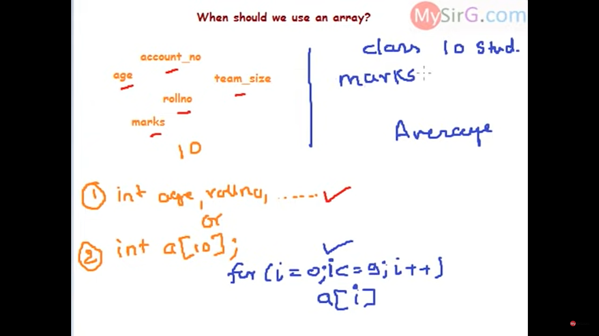
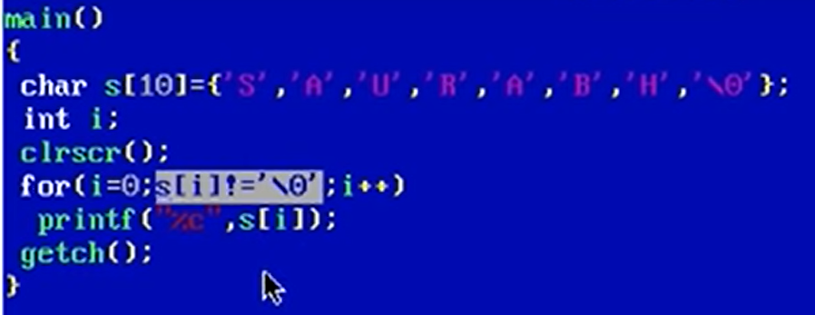

## Lec 39 - (Lec - 10 Recursion in C (Part-1))

**Recursion**

- Function Calling Itself is called Recursion.

Program to add 1st N natural number: 

STEPS:


Memory of 3rd step get released because of return of "a" to s = a+fun(a-1)

 


"fun" is replaced by "sum": (for simplicity)

Program to add 1st N natural number:


Example With Changed value: i.e. Sum of 10 natural numbers:


```c
//Sum of 10 natural numbers:

#include<stdio.h>

int sum(int a){
       int s;
       if(a==1)
       return a;
       s = a + sum(a-1);
       return s;
}

int main(){
    int k;
    k = sum(10);
    printf("%d",k);
}
```

--------

## Lec 40 - (Lecture 11 Arrays in C Part 1)

- Array is a linear collection of similar elements (Similar element like int, float, char etc).

- Array is also known as Subscript variable.

- Array is a group of variable.

```c
//Write a program of avrage of 10 numbers:


#include <stdio.h>
int main(){
    int a[10], i, sum = 0;
    printf("Enter 10 Numbers: ");
    for(i=0; i<=9; i++)
        scanf("%d", &a[i]);

    for(i=0; i<=9; i++)
        sum = sum + a[i];

    float avg = sum/10.0;
    printf("Average is %f",avg);
    return 0;
}
```

Extra Programming Qs:

1) Make an array and Enter 10 numbers and find  find the bigger value.

2) Take 10 values from user and find the sum of  even numbers and odd numbers seprately...

-----------

## Lec 41 - (Lecture 11 Arrays in C Part 2)

Declaration of Array:

- int a[ ];    // Error 

- int a[5];

- int a[5] = {9,6,8,0,2};
  
  

- int a[ ] = {9,6,8,0,2};

- int a[5] = {9,6,8,0,2,4,7};        // Error i.e. two many initialisers

- int a[5] = {9,6};
  
  

Note: Since only 2 values are initialise (and Array is of size 5).... Automatically assign "0" in blocks that are left...

---------

## Lec 42 - (Lecture 12 Two Dimensional Arrays in C P-1)

Two Dimensional Arrays - are Array of arrays...


```c
// Code for addition of two matrices:

#include <stdio.h>
int main(){
    int A[3][3],B[3][3],C[3][3],i,j;
    printf("Enter 9 number for the first matrix 1: ");
    for(i=0; i<=2; i++)
        for(j=0; j<=2; j++)
            scanf("%d", &A[i][j]);
    printf("Enter 9 number for the first matrix 2: ");
    for(i=0; i<=2; i++)
        for(j=0; j<=2; j++)
            scanf("%d", &B[i][j]);

    for(i=0; i<=2; i++){
        for(j=0; j<=2; j++){
            C[i][j]=A[i][j]+B[i][j];
            printf("%d ",C[i][j]);
        }
        printf("\n");
    }
    return 0;
}
```

------------

## Lec 43 - (When to use array in a program)




------

## Lec 44 - (Lecture 13 Strings in C Part 1)

**<u>String:</u>**

- Sequence of characters terminated at null character.

- ASCII code of null character is 0 (zero)




NOTE:

Character Constant are written on single quotes i.e. ' '


If we want to print the elements of char array:

```c
#include<stdio.h>
int main(){
    char s[10] = {'N','A','N','D','A','N','\0'};
    int i;
    // for(i=0;i<=6;i++)
    for(i=0;s[i]!='\0';i++)
    printf("%c",s[i]);
}
//Note: When we need to examine each character then we need to use loop method
```

(OR)

```c
#include<stdio.h>
int main(){
    char s[10] = {'N','A','N','D','A','N','\0'};
    printf("%s",s);
}
// Note: When we need to only print the string we use this %s method
```

(OR)

```c
// Use of puts to print only string and automatically changes the line 
// In printf we need to use "\n"
#include<stdio.h>
int main(){
    char s[10] = {'N','A','N','D','A','N','\0'};
    puts(s);
}
```

(OR)

```c
#include<stdio.h>
int main(){
    char s[10] = "NANDAN";
    puts(s);
}
```

(OR)

```c
#include<stdio.h>
int main(){
    char s[20];
    printf("Enter your name: ");
   // scanf("%s",s);
     scanf("%s",&s[0]);
    puts(s);
    //   puts(&s[0]);
}
```

(OR)

```c
#include<stdio.h>
int main(){
    char s[20];
    printf("Enter your name: ");
    gets(s);
    puts(s);
    // puts(&s[0]);
}
```

------------

## Lec 45 - (Lecture 13 Strings in C Part 2)


(Details and Programs are on other Videos)


```c
 #include<stdio.h>
int main(){
    char s[3][10];
    int i;
    printf("Enter three strings: ");
    for(i=0;i<=2;i++)
    gets(&s[i][0]); 
    //gets(s[i]);
    
    for(i=0;i<=2;i++)
    printf("%s\n",s[i]);
}
```


------------

## Lec 46 - (Lec 14 Pointers in C Part 1)

Objective:

- Pointer basics
- Pointer’s Arithmetic
- Application of pointers


**<u>Basics of Pointers:</u>**


<u>Address of Operator</u>

- & is known as address of operator

- It is an unary operator

-  Operand must be the name of variable

-  & operator gives address number of variable

-  & is also known as referencing operator (Address and reference are same thing)


<u>lndirection Operator</u>

- ***** is indirection operator

- It is also known as dereferencing operator

- It is an unary operator

- It takes address as an argument

- ***** returns the content/container whose address is its argument.


- %d -> -32768 to 32767

- %u -> 0 to 65535

Use "%u" instead of "%d" while printing Address...


&x is Constant (NOT a VARIABLE)

So, &x=7; is WRONG...


We need to use int *j which represents that j is a special variable that contains address...


**<u>Pointer</u>** 

- Pointer is a variable that contains address of another variable.

- Pointer always consumes 2 bytes in memory (According to DOS based Artitacture)


Note: 

- In 2nd printf; " *j " seen as "x"... 

i.e.     *j = x

- In  3rd  printf("%u", *&j);    => Cancel " * " and "&" to each other... and treat it as only "j"


NOTE: (RULE)

Pointer jis Data-Type ki madad se bana hota hai.. ussi type ke variable ka address contain karta hai...

 ------------------

## Lec 47 - (Lec 14 Pointers in C Part 2)

Objective:

- Extended Concept of Pointers

-  Pointer’s Arithmetic

-  Application of pointers


**<u>Extended Concept of Pointers</u>**


x -> x is an int variable

*p -> p is a pointer to an int

**q -> q is a pointer to a pointer to an int

***r -> r is a pointer to  a pointer to a pointer to an int

**q is x        i.e. **q = 7 Therefore, x=7

***r is x         i.e. ***r = 7 Therefore, x=7


**<u>Pointer’s Arithmetic</u>**

- We cannot add, multiply or divide two addresses (Subtraction is possible)
  
  
  
  Also &a*&b; and p*q; is not possible
  
  similarly, &a/&b; and p/q; is not possible
  
  

- We cannot multiply an integer to an address and similarly we cannot divide an address with an integer value

    

Also similarly, &a/5; and p/5; is not possible


- We can add or subtract integer to/from an address


- Pointer + n = pointer + sizeof(type of pointer)* n

e.g.:


- We can subtract two addresses of same type.

- Pointer1 - pointer2 = Literal subtraction / sizeof(type of pointer)

e.g.:


