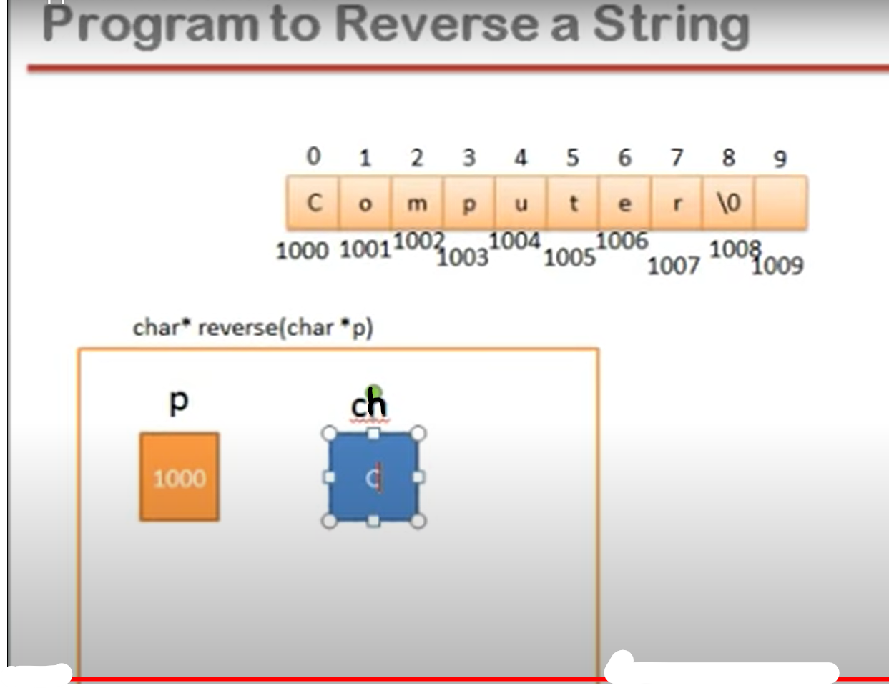

## Lec 48 - (Lec 15 - Applications of Pointers in C Part 1)

------------


```c
//Swaping of two numbers

#include<stdio.h>
int main(){
    int a,b,t;
    printf("Enter two number: ");
    scanf("%d%d",&a,&b);
    t = a;
    a = b;
    b = t;
    printf("a is %d,  b is %d",a,b);

}
```

(OR)

```c
#include<stdio.h>
    int t;
    void swap(int *x,int *y){
         t = *x;     //*x = a
        *x = *y;    //*y = b
        *y = t;
    }

int main(){
    int a,b;
    printf("Enter two number: ");
    scanf("%d%d",&a,&b);

    swap(&a,&b);  //Function call by passing address (or) function call by reference
    printf("a is %d,  b is %d",a,b);

}
```

**<u>Call by reference</u>**

- Call by reference is same as call by address

- When formal arguments are pointer variables, it is call by reference

- Reference means address

---------

## Lec 49 - (Lec 15 - Applications of Pointers in C Part 2)


scanf("%d",&a[i]);        (OR)        scanf("%d",p+i);

printf("%d",a[i]);            (OR)        printf("%d",*(p+i));

```c
//(Conclusion -> How to access Array using Pointers)

#include<stdio.h>

void input(int *p){
    int i;
    for(i=0;i<=4;i++)
    scanf("%d",p+i);
}
void display(int *p){
    int i;
    for(i=0;i<=4;i++)
    printf("%d ",*(p+i));
}
void sort(int *p){
    int round,t,i;
    for(round=1;round<=4;round++){  //Logic of Bubble Sort
        for(i=0;i<=4-round;i++)
        if(*(p+i) > *(p+i+1)){
            // Now Swapping
            t = *(p+i); //a[i] = *(p+i)
            *(p+i) = *(p+i+1);
            *(p+i+1) = t;
        }
    }
}

int main(){
    int a[5];
    input(a);
    display(a);
    printf("\n");
    sort(a);
    display(a);
}
```

[Bubble Sort - GeeksforGeeks](https://www.geeksforgeeks.org/bubble-sort/) - DO it

[Bubble Sort Visualization](https://opendsa-server.cs.vt.edu/embed/bubblesortAV)

----------

## Lec 50 - (Lec 15 - Applications of Pointers in C Part 3)


- strlen(s);        //        strlen(&s[0]);        //        strlen("Computer");

```c
// Write a function to calculate length of a string


#include<stdio.h>

int length(char *p){
    int i;
    for(i=0; *(p+i)!='\0';i++);
    return i;
}

char* reverse(char *p)
{
    int l,i;
    char t;
    for(l=0;*(p+l)!='\0';l++);
    for(i=0;i<l/2;i++){
        t = *(p+i);
        *(p+i) = *(p+l-1-i);
        *(p+l-1-i) = t;
    }
    return p;
}

int main(){
char st[]="Computer";
   printf("%d\n",length(st));
   printf("%s",reverse(st));
}
```

[Reverse a String in C - javatpoint](https://www.javatpoint.com/reverse-a-string-in-c)

- *(p+i)       =    s[i]

---------

## Lec 51 - (Lecture 15 Application of Pointers in C Part 4)

- Pointer and Strings



```c
// Write a function to reverse a string    (??)
#include<stdio.h>

char* reverse(char *p)
{
    int l,i;
    char ch;

    for(l=0;*(p+l)!='\0';l++);  //Gives l = 8
    for(i=0;i<l/2;i++){
        ch = *(p+i);
        *(p+i) = *(p+l-1-i);
        *(p+l-1-i) = ch;        // l = 8
    }
    return p;   // since, Address is in p
}

int main(){
   char st[] = "Computer";
   printf("%s",reverse(st));
}
```

char* -> It means ye char block ka address return karega...

char *p -> It receives the Address...

----------

## Lec 52 - (Lecture 15 Application of pointers in C  Part 5)

(-----)

------

## Lec 53 - (Lecture 16 Structure in C Language Part -1)

What is structure?

- Structure is a way to group variables


- Structure is a collection of dissimilar elements

- Defining structure means creating new data type


**<u>NOTE:</u>** 

<u>Memory Consumption</u>

- No memory is consumed for definition of structure.


float - > Data type, and X -> variable

similarly....

date -> Data type, and today -> variable and struct is always recommended (NOTE: struct is a keyword)


NOTE:


TASK: Assign "today" to "d1"


We had copied value individually...


(OR) simply do.... and Also taking values as Input


```c
#include <stdio.h>

struct date{
  int d,m,y;  
};

int main(){
    
   // struct date today = {18,4,2022};
   struct date today,d1;
   /*
   today.d=18;
   today.m=4;
   today.y=2022;
   */
   // printf("%d/%d/%d",today.d,today.m,today.y);
    
    d1=today;
    
    printf("Enter today's date: ");
    scanf("%d/%d/%d",&d1.d,&d1.m,&d1.y);
    printf("Date: %d/%d/%d",d1.d,d1.m,d1.y);
}
```

-----

## Lec 54 - (Lecture 16 Structure in C language Part 2)

```c
// NOT WORKING??????????????????

#include <stdio.h>

struct book{
    int bookid;
    char title[20];
    float price;
};
struct book input(){
    struct book b;
    printf("Enter bookid, title and price: \n");
    scanf("%d",&b.bookid);
    fflush(stdin);
    gets(b.title);  //Takes String
    scanf("%f",&b.price);
    return b;
}
void display(struct book b){
    printf("\n %d %s %f", b.bookid,b.title,b.price);
}
void main(){
    struct book b1;   
    //NOTE: type of "b1" is "book" (and struct is only a keyword)
    b1 = input();
    display(b1);
    
}
```

---------

## Lec 55 - (Lecture 18 Dynamic Memory Allocation in C Part 1)

Two ways to make variables:

- SMA: Static Memory Allocation 

            - Write Declaration Statement and make variables...

            (Declaration Statement and Action Statement)

- DMA: Dynamic Memory Allocation

            (There is no name of the variables, only Address is there (Address is only required to access the Variable))


**<u>DMA (Dynamic Memory Allocation):</u>**    
malloc()

calloc()

realloc() 

free()


(For Applications and Use see Data Structure playlist By Saurav Shukla Sir...)


1) **malloc()**    :- Returns Address of the block that malloc() create itself...
   
   return type of malloc is void pointer
   
   We pass the size of the memory block in the malloc function as an Argument.


- Using malloc, we make only one block...


```c
// Explanation
#include <stdio.h>
void main(){
    float *p;
    
    p=(float*)malloc(4);    // Type Cast => use of (float*)
// malloc(4)    => means 4 bytes
    *p = 3.4;
}
```

----------

## Lec 56 - (Lecture 18 Dynamic Memory Allocation in C Part 2)

2. **calloc()**    :- 
   
   Here, we pass the 2 Arguments...

        We are not telling that which Data type variable we have to make but  we tells the size of Variable we have to make...

- Using calloc, we make an Array...


**<u>malloc() Vs calloc()</u>**


- Using malloc, we make only one block...

        Using calloc, we make an Array...


calloc(5,2)    => 5-> No. of column and 2-> size of Data type i.e. integer...(2 bytes)


3. **realloc()**    :-

Memory Block made from malloc or calloc, if we need to resize it then we use realloc().


realloc(ptr,8)    =>         ptr-> Address and 8-> Size (i.e. 8 bytes)


4. **free()**   :- It releases  the memory made from malloc, calloc or resize from realloc...


- Memory leak (Consumed area which cann't be accessible -> If we don't use free())

----------------
