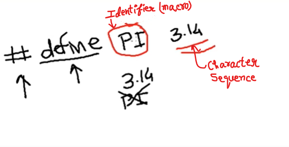
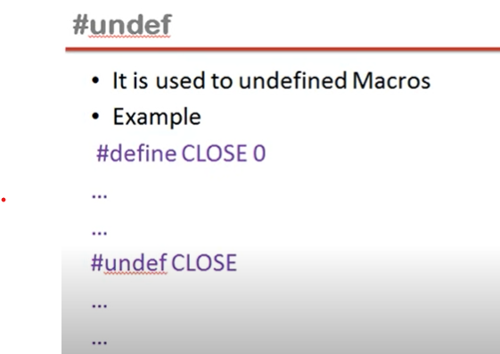

## Lec 57 - (Lecture 17 union in C Language Part 1)

What is union?

- Union is similar to structure, except it allows you to define variables that share storage space

- Defining union means creating new data type

**struct Vs union:**


i1 in <u>union</u> gets only that much  memory that the maximum memory taken by float y i.e. 4 bytes

so, item type variable gets 4 bytes memory... 

Example:


```c
#include <stdio.h>

union Item{
    int x;
    float y;
    char z;
};
int main(){

   union Item i1;
   i1.x=2;
   printf("x = %d\n",i1.x);

   i1.y=3.5;
   printf("y = %f\n",i1.y);

   i1.z='a';
   printf("z = %c\n",i1.z);

   return 0;
}
```

Disscussion:


At particular time we can print / do only one thing...

**How to access?**

- Union members are accessed in the same manner as we access structure member

---------

## Lec 58 - (Lecture 19 Enumerators in C Language)

3 Ways to create own data type:

1) structure (struct)

2) union

3) enumerator (enum)

**<u>Enumerators:</u>**

- lt gives an opportunity to invent own data type and define what values the variable of this data type can take.

**<u>Creating variables of enumerators:</u>**


    jan-dec are the possible values which will store in the variables of "month" data type...


Another Example:


 

For readibility of the program we use  true, false instead of 0, 1...

```c
#include <stdio.h>

enum boolen
{
    false,true
};

enum boolen isEven(int x){
    if(x%2==0)
        return(true);
    else
        return(false);
}

int main(){
    int n;
    enum boolen result;
    printf("Enter a number: ");
    scanf("%d",&n);
    result = isEven(n);
    if(result == true)
        printf("EVEN NUMBER");
    else
        printf("ODD NUMBER");

    return 0;
}
```

-------

## Lec 59 - (Lecture 20 typedef in C language)

What is typedef?

- typedef is a keyword

- We can use typedef to give new name to a type
  typedef int LENGTH;

- Now you can use LENGTH as a data type which is just same as int
  
  LENGTH x,y;

- By convention, uppercase letters are used for these definitions to remind the user that the type name is really a symbolic abbreviation, but you can use lowercase

EXAMPLE:


(OR)

```c
// type struct student{
type struct{
    int rollno;
    char name[20];
    int age;
}STUDENT;        // <--- See
void main(){
    STUDENT s1;
    s1.rollno=34;
    strcpy(s1.name,"Nandan");
    s1.age=20;
}
```

---------------

## Lec 60 - (Lecture 21 Preprocessor Command #include in C Language)

What is Pre-processor?

- Pre-processor is a program which performs before the compilation.

- Pre-processor only notices # started statements

- "#" is called <u>pre-processor directive</u>

- Each preprocessing directive must be on its own line.

- The word after # is called pre-processor command


- include is one of the most popular pre-processor command

- It can be used include any file content to your source file


Example:


<u>Inclusion of another source file</u>

- You can write your source code in multiple .c files

- You can include all these source files in the same way as you include header files

----------

## Lec 61 - (Lecture 22 Pre-processor Command #define #undef in C)


**<u>#define</u>**:

The #define directive defines an identifier and a character sequence ( a set of characters ) that will be substituted for the identifier each time it is encountered in the source file.



- The identifier is referred to as a macro name and the replacement process as macro replacement.

- #define macro-name char-sequence

Example:

- #define PI 3.14

- #define MSG "hello"


```c
//Program of Area of Circle using "#define"

#include <stdio.h>
#define PI 3.14
int main(){
    int r;
    float a;
    
    printf("Enter radius of a circle: ");
    scanf("%d",&r);
    a=PI*r*r;
    printf("Area of Circle is %f",a);
    return 0;
}
```

**<u>Defining Macro like a function</u>**:


EXAMPLE:1


```c
//Use of macro as function
#include <stdio.h>
#define sum(a,b) a+b
int main(){
    printf("Sum of 3 and 4 is %d",sum(3,4));    
//seems like calling a function sum(a,b)
    return 0;
}
```

EXAMPLE: 2


Solution for <u>PRODUCT(3+2,4-6)</u>:


Solution:

```c
#include <stdio.h>
//#define PRODUCT(a,b) a*b
#define PRODUCT(a,b) (a)*(b)
int main(){
    // printf("Product of a and b is %d",PRODUCT(3,4));
    printf("Product of a and b is %d",PRODUCT(3+2,4-6));   
    return 0;
}
```


**<u>#undef</u>**:

- It is used to undefined Macros

When we create macro using #define and after use of it, and when we not need macro further then we can remove it by using #undef...


- no need to use character sequence in #undef.... only macro is required...



-------------------

## Lec 62 - (Lecture 23 Preprocessor Commands in C)


<u>**#if‚ #else, #elif‚ #endif**</u> :


- As a file is being compiled, you can use these commands to cause certain lines of code to be included or not included (for compilation)


```c
// Printing "pakistani Rupees" which is wrong??????????

#include <stdio.h>
#define COUNTRY India
int main(){
#if COUNTRY == Pakistan
    printf("Pakistani Rupees");
#elif COUNTRY == Bangladesh
    printf("Taka");
#elif COUNTRY == Nepal
    printf("Nepali Rupees");
#else
    printf("INDIAN RUPEES");
#endif
    return 0;
}
```

**<u>#ifdef‚ #ifndef</u>** :

        **#ifdef macro**

- If the macro has been defined by a #define statement, then the code immediately following the command will be compiled
  
  
  
  **#ifndef**

- If the macro has **not** been defined by a #define statement, then the code immediately following the command will be compiled.


## **</u>

- The ## operator is used with the #define macro. 

- Using ## concatenates what's before the ## with what's after it


(Concatenate means mil jaayenge)

---------
