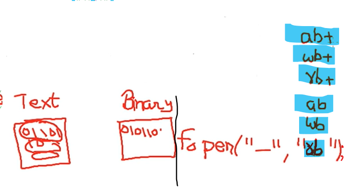

## Lec 63 - (Lecture 24 File Handling in C)

Why File Handling?

- Data

- Data persistence

- Files

- File handling

If same data is to be processed again at some later stage, again we have to enter it.


FILE is a data type, already made in stdio.h

File data type is made up using structure


*fp (file pointer) is a pointer that points to a file type variable (which has a pointer which points to an actual file)

---------

## Lec 64 - (Lecture 25 Writing in a file in C)


(NOTE: FILE is a Non-primitive data type and Non-pritive data type is made with the help of structure... for us it's like pre-defined function but it's declaration is present in stdio.h header file)


```c
// Write a program to write hello students in a file.

#include<stdio.h>
int main()
{
    int i;
    FILE *fp;
    char s[]="Hello Students";
    fp=fopen("f1.txt","w");
    if(fp==NULL){
        printf("File cannot open");
        exit(1);
    }
    
    for(i=0;i<strlen(s);i++)
        fputc(s[i],fp);
        getch();
    fclose(fp);
    getch();
}

```


```c
//Write a program to take string from user and write it into a file.


#include<stdio.h>
int main()
{
    int i;
    FILE *fp;
    // char s[]="Hello Students";
    char s[100];
    fp=fopen("f1.txt","w");
    if(fp==NULL){
        printf("File cannot open");
        exit(1);
    }
    printf("Enter a string");
    gets(s);
    for(i=0;i<strlen(s);i++)
        fputc(s[i],fp);
        getch();
    fclose(fp);
    getch();
}
```


**Note:**

 fp (File Pointer)    ----->        File type Variable        ----->        Buffer

fp pointing to the File type variable...

Since, In file structure there is a variable with the name buffer...

When we perform close operation (or) the buffer gets full; all data will go to f1.txt file...


fopen creates a buffer which representing file i.e. f1.txt and also create file type variable in which buffer pointer also points it...

i.e.  fopen return address of file type variable.

fputc => fputc write the s[i] and use fp  and write in the buffer...


fclose => If file is open one time then to represent/handel the file we need file pointer i.e. fp

we need to pass file pointer fp in fclose i.e. fclose(fp);


If buffer gets full then all the data gets automatically gets stored in the file and buffer gets vacant and we are able to enter the next  data...

and 

If buffer not getting full after writing the data and our work is done then to write the data of buffer forcefully in the file, we call fclose function.... and the memory of  the buffer and file type variable also gets release... and fp is not pointing to that variable...


--------------

## Lec 65 - File Opening Modes in C Language Hindi


**<u>fopen()</u>**


* fp = fopen("filename","mode");


```c
#include<stdio.h>
int main()
{
    FILE *fp;
    fp=fopen("myfile.dat","r");
    // fp=fopen("myfile.dat","r+");
    if(fp==NULL){
        printf("File Not Found");
}
```


In case of r (or) r+ ,file is not existing then new file will not create... and we will not  able to read... i.e. NULL will return....

And,

In case of other modes like w, a, w+, a+ if the file is not existing  then still new file will be create (Bhaale hi EMPTY rahe....) and file will open...


**NOTE:-**

If FILE is existing, and we are using in "w" mode then the old data/content of the existing file will erase and file will  be open as EMPTY file... Now whatever we write will start from the beginning... there will be no old data exist....


-------------

## Lec 66 - Reading from a file in C Language Hindi

Reading from a file means

- Extracting data from a file to our program variables

- This will not remove data from the file


 

```c
//WAP to read content from a file and display on the screen.
#include<stdio.h>
int main()
{
    char ch;
    FILE *fp;
    fp=fopen("f1.txt","r");
//"r" => r in double quotes because this should be give in string form 
    if(fp==NULL){
        printf("File Not Found");
        exit(1);
    }
    ch=fgetc(fp);
    while(!feof(fp)){
        printf("%c",ch);
        ch=fgetc(fp);
    }
    fclose(fp);
}


```


fgetc return a character which is present in the 1st byte of the file...

i.e. ch=fgetc();


we gave "fp" so that fgetc will get that from which file we need to read the character...    i.e. fgetc(fp);

Since fp will give the address of file type variable which have Pointer and which points file...

--+---

feof => End of file    => Pre-defined function to check the end of the file, It returns true or false i.e. 1 or 0...

i.e. while(!feof(fp))

fp indicates the file we are talking about...

-----

## Lec  67 - Reading from file using fgets()

**<u>fgets()</u>**

* fgets() is a function to read string from a file...


* fgets( str, n, fp);

(We need to pass 3 Arrguments...

1st Arrgument (i.e. str) -> We have made a char array in which we want to put the string from the files

2nd Arrgument (i.e. n) -> String of how much character  // No. of characters we want to read...

3rd Arrgument (i.e. fp) -> File pointer helps to handle the file...)


* fgets returns a NULL value when it reads EOF    (End Of File)

(NULL means we will know that there is no any other data in the file)


```c
/* Write a program to read content from a file 
and display on the screen. Use fgets() to read
String from the file. */

#include<stdio.h>
main()
{
    char str[10];
    FILE *fp;
    fp=fopen("f1.txt","r");  //NOTE: f1.txt already exist in folder
    if(fp==NULL){
        print("File Not Found");
        exit(1);
    }
    while(fgets(str,9,fp) != NULL){
        printf("%s",str);
    }
    fclose(fp);
}
```

Since, fgets returns a NULL value when it reads EOF    (End Of File)

i.e. fgets(str,9,fp)


while(fgets(str,9,fp) != NULL)     => Jab tak Null nahi return kar raha hai... Tab tak loop ko chalaau....

When its return NULL, the loop will automatically stops...

-------

## Lec 68 - Writing in a file using fputs

**<u>fputs</u>**

- fputs() is a function declared in stdio.h header file


- fputs(str,fp);

In fputs 2 Arrgumnets need to pass...

1st Arrgument (i.e. str) :-  string which we need to send in the file...

2nd Arrgument (i.e. fp) :- File pointer

(Note:- Pointer jis type ka hota hai..ussi type ka variable ka address contain karta hai...)


```c
// Write a program to write a string to a file. Use 
// fputs() to write content to the file.

#include<stdio.h>
int main{
    char str[20];
    FILE *fp;
    fp = fopen("f1.txt","w");    
    //f1.txt file already exist in the computer there will be no
// any result in the output screen (Monitor)...

    //    fp = fopen("f1.txt","a");    

    printf("Enter Your Name ");
    gets(str);
    fputs(str,fp);
    fclose(fp);
}


```


fgets()    => Take string from the file (related to the File)

fputs    => We are writing string in the File (related to the File)


gets()    => Take data from the keyboard... (related to the Keyboard)

puts()    => It is related to the moniter...

----------

## Lec 69 - Writing file using fwrite() function

**<u>fwrite()</u>**

- fwrite() function is used to write content to the file in **<u>*binary mode*</u>**.


- int fwrite(void *Buffer, int Size, int Count, FILE *ptr);
  
  4 Arruguments going to be pass in fwrite():
  
  1st Arrgument : (i.e. void *Buffer) => Going to pass address of that memory block (Variable) in which stored data is needed to forward (store) to File....

        2nd Arrgument : How much data need to forward to the file (or) Size of the data which we are going to write...

                for the size we are going to use the size of operator... i.e. sizeof()

        3rd Arrgument : Number of such record to write (Aise kitne record hai jo ek baar mai write karne hai...)

        4th Arrgument : File pointer i.e. fp


Actual File exist in the Hard disk...

Buffer space which contains the file data...

File type Variable cointain buffer pointer which pointing the buffer...

--++-----------

In case of Files there are two types of Mode:

1) Text Mode

2) Binary Mode


<u>Text Mode</u>:- A file is considered as a sequence of characters (Character means sequence of 0,1).

<u>Binary Mode</u>:- Here In Binary Mode, We doesn't considered... sequence of 0,1... as Character... 


use of "b" in the suffix of mode selection (i.e r, w, a, r+, w+, a+) so that its open in Binary mode.... (i.e. rb, wb, ab, rb+, wb+, ab+)




Q. Why it is necessary that we have open any file in Text or Binary?

Answer:- 

E.g.:-  Let we write a character i.e. \n 

(Does in file, line also change????? (or) the code of "\n" stored in 0,1 form???)


If we are working on <u>text mode</u> then use of "\n" results to change in the line in the file...

In Binary Mode; "\n" will not considered as a special character, it will store as it is...

Conclusion:

In Text mode, Special characters are stored according to its meaning....

in Binary mode, doesn't need that what type of Data it is... it stored as the sequence of 0,1....


```c
#include<stdio.h>
struct book
{
    int bookid;
    char title[20];
    float price; 
};
void main()
{
    struct book b1;
    FILE *fp;
    fp=fopen("myfile.dat","wb");
    // fp=fopen("myfile.dat","ab");
    printf("Enter bookid, title and price: ");
    scanf("%d",&b1.bookid);
    fflush(stdin);
    gets(b1.title);
    scanf("%f",&b1.price);
    fwrite(&b1,sizeof(b1),1,fp);
// fwrite function tooks 4 Arrguments...
    fclose(fp);
}

/*NOTE: 
All the details will shown in the file that going to be create... 
It's not going to show details in the Monitor or Output screen... */
```


Issue in the Program:

Lets take Buffer as an array... scanf or gets take data from the buffer and sended to  the variable...


For solving this issue (i.e. Jab gets chal raha hai to buffer khaali nahi mil raha hai..) we need to use "fflush"; to clean the buffer...

stdin denotes standard input buffer...

---------

## Lec 70 - Reading from a file using fread in C

**<u>fread()</u>**:

- fread() function is used to read content from file in **<u><em>binary mode</em></u>**.


- int fread(void *Buffer, int Size, int Count, FILE *ptr);


```c
/*Write a program to read content from a file
and display on the screen. Use fread() to read
content from the file.*/


#include<stdio.h>
struct book
{
    int bookid;
    char title[20];
    float price; 
};
void main()
{
    struct book b1;
    FILE *fp;
    fp=fopen("myfile.dat","rb");
// Note: myfile.dat already exist in the computer... 
// From computer; we extracting the data...
    if(fp==NULL){
        printf("File not found");
        exit(1);
    }
    fread(&b1,sizeof(b1),1,fp);
    printf("%d %s %f",b1.bookid,b1.title,b1.price);
    fclose(fp);
}
```


```c
// Same as previous program but here we get multiple data from the 
// existing file in the computer to the output screen...


#include<stdio.h>
struct book
{
    int bookid;
    char title[20];
    float price; 
};
void main()
{
    struct book b1;
    int a; //Just for understanding...
    FILE *fp;
    fp=fopen("myfile.dat","rb");
    if(fp==NULL){
        printf("File not found");
        exit(1);
    }
  /*  
    while(fread(&b1,sizeof(b1),1,fp)>0)
        // Here we get Multple times data
*/
    a = fread(&b1,sizeof(b1),1,fp);
    {
        printf("a = %d",a);
        printf("%d %s %f\n",b1.bookid,b1.title,b1.price);    
    }

      a = fread(&b1,sizeof(b1),1,fp);
         printf("a = %d",a);

      a = fread(&b1,sizeof(b1),1,fp);
         printf("a = %d",a);
    fclose(fp);
}

/* This example is showing that " fread(&b1,sizeof(b1),1,fp); "
returns on 1 or 0 i.e. true or false.... 
(Agar file mai record hai..aur fread ne record read kiya hai 
to wo 1 return karega... i.e. TRUE...
Aur agr file mai record hi nahi bache hai to fread read nahi
kar paayega aur return karega 0...i.e. FALSE...)
To jab tak 0 (False) nahi aata hai tabtak hum fread ko chalate 
rahenge...
*/
```


```c
// Contd. previously
#include<stdio.h>
struct book
{
    int bookid;
    char title[20];
    float price; 
};
void main()
{
    struct book b1;
    FILE *fp;
    fp=fopen("myfile.dat","rb");
    if(fp==NULL){
        printf("File not found");
        exit(1);
    }
     while(fread(&b1,sizeof(b1),1,fp)>0);
    {
         printf("%d %s %f\n",b1.bookid,b1.title,b1.price);
    }
     fclose(fp);
}
```


------------

## Lec 71 - Writing in a file using fprinf function in C

**<u>fprintf()</u>**:

- fprintf() function is used to write formatted output to the specified stream


- int fprintf (FILE *stream, const char *format [,argument, ...]);


- fprintf(fp, "\nSum of %d and %d is %d", a,b,c);


```c
// Write a program to write content to a file. Use
// fprintf() to write content to the file.

#include<stdio.h>
main()
{
        FILE *fp;
        int a,b;
        fp=fopen("f1.txt","w");
        printf("Enter two numbers ");
        scanf("%d%d",&a,&b);
       // printf("Sum of %d and %d is %d",a,b,a+b); 
        // for hint in fprintf 
        fprintf(fp,"Sum of %d and %d is %d",a,b,a+b);
        fclose(fp);
}

/* The result will not show in the Output screen or monitor...
Result will print/shown in the file f1.txt...

Conclusion:
If we want formatted output then we will use fprintf function...
*/ 
```


------------

## Lec 71  - Reading from a file using fscanf() function


**<u>fscanf</u>**:


- fscanf() function is used to read formatted content from file.

- int fscanf ( FILE * stream, const char * format, ...);

- Reads data from the stream and stores them according to the parameter format into the locations pointed by the additional arguments...


**scanf:**

scanf tooks...... \n, \t, '  ' =>(SPACE) these as a data separator symbols...


```c
// Write a program to read content from a file and display on the 
// screen. Use fscanf() to read content from the file.

#include<stdio.h>
int main()
{
    FILE *fp;
    int a, b, c;
    fp = fopen("f1.txt", "r");
//NOTE: f1.txt already exist in the computer containing 3 digits...
    
    //scanf("%d%d%d", &a,&b,&c);    //<= For hint in fscanf
    
    fscanf(fp, "%d%d%d", &a,&b,&c); // In file => 10 20 30
    
    // fscanf(fp, "%d,%d,%d", &a,&b,&c); // If in file => 10, 20, 30

    printf("a=%d, b=%d, c=%d", a,b,c);
    fclose(fp);
}


```

-----------


