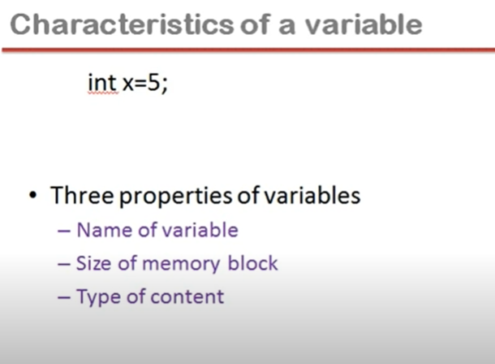
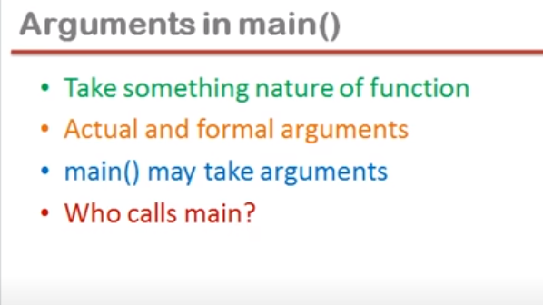

## Lec 73 - Storage classes in C Language (Part - 1)

<u>In DECLARATION Statement //  Data type declaration Instruction</u>:

Name of the variable

size of the memory block

Type of content that can store...




Other properties of variable:

- Default Value

- Storage

- Scope 

- Life

Default Value: (i.e.  Jab kuch assign nahi kiya to usme value kya hai....)

e.g.: Garbage Value

Storage: Where we get Memory in RAM or CPU register...

Scope: (Area under which we can access the Variable...)

Life: If variable created in the memory and get destroyed... under that period i.e. created and destroyed... is called <u>life of the Variable</u>....

Decelartion Statement // Storage Classes Can be classified into 4 Types:

1. Auto (or) Automatic storage class

2. Register storage class

3. Static Storage class

4. External storage class


1. **<u>Automatic storage class</u>**:

```c
#include<stdio.h>
int main()
{
    int x=5;
    printf("%d\n",x);
    {
        int x = 2;
        printf("%d\n",x);
    }    
    printf("%d\n",x);
}
// Note: 
// RULE - The Variable which is more local will get preference...
```

2. **<u>Register storage class</u>**:

```c
#include<stdio.h>
int main()
{
    register int x = 4;
    int y;
    y = x++;
    x--;
    y=x+5;

}
```


t => Time taken by the data of variable to reach the Processor from RAM

ALU executes instruction in (t/10) time

Time taken to reach Data to the processor is more than the time of execution of instruction... so the overall time is increases i.e. Speed of program seem to be less... so that We can Allot the Variable which is used in continuous basis in the CPU resister...

NOTE:

Variable is alloted to the resistor at certain condition-

1) It depends on whether Resisters are available or not...
2. If the variable is other than int or char like float, double ,long etc then also in this case resistor will not allot... (Instead of giving to the resistor it will Automatically give to the RAM)

-------------

## Lec 74 - Storage classes (Part - 2)

3. **<u>Static Storage class</u>**:

```c
// Without Using Static
#include<stdio.h>
void f1();
int main()
{
    f1();
    f1();
}
void f1()
{
    int i=0;
    i++;
    printf("i=%d\n",i);
}
```

In static the default value is 0 (Zero) i.e. we don't need to mention the i = 0

```c
// Using Static; Here output is different than previous programming..
#include<stdio.h>
void f1();
int main()
{
    f1();
    f1();
}
void f1()
{
    static int i ;
    i++;
    printf("i=%d\n",i);
}
```

4. <u>**External storage class**</u>:

```c
// Example of External:
#include<stdio.h>

int x;
main()
{
    printf("x = %d\n",x);
    f1();
    printf("x = %d\n",x);
}
void f1()
{
    x++;
    printf("x = %d\n",x);
}
```

```c
// Example of External:
#include<stdio.h>


main()
{
    extern int x;    //See Note...
    printf("x = %d\n",x);
    f1();
    printf("x = %d\n",x);
}
int x;    // Here we shifted int... so error will show
void f1()
{
    x++;
    printf("x = %d\n",x);
}
```

<u>Note</u>:

extern int x;     =>  It's not an decleration statement, (Ye line sirf Inform kar rahi hai... ki bahar jo "x" hai... Usko hum iss function mai use karenge...)

(By using Extern, Compiler ko patta chal gaya hai ki bahar koi "x" hai....)

```c
#include<stdio.h>

int x;
main()
{
    printf("x = %d\n",x);
    f1();
    printf("x = %d\n",x);
}
void f1()
{
    int x=5;    //Added part, Get different output...
    x++;
    printf("x = %d\n",x);
}
```

```c
//This Example will show that extern is not an DECLARATION STATEMENT
#include<stdio.h>
main()
{
    extern int x;    // This Line is not an DECLARATION STATEMENT
    printf("x = %d\n",x);
    printf("x = %d\n",x);
}

// In output screen Error will be shown....
```

-----

## Lec 75 - Bit Fields in C

<u>**Characteristics of a variable**</u>:

- Bit fields are use to consume memory efficiently when we know that the value of a field or group of fields will never exceed a limit or is within a small range...

- It can be used in structure and union


Code blocks (32 bits)    => int consumes 4 bits 

Turbo 3.0 (16 bits)        => int consumes 2 bits


4 bytes = 32 bits

So "d" tooks 32 bites

And "m" tooks 32 bites

```c
#include<stdio.h>
struct date
{
    unsigned int d;
    unsigned int m;
    unsigned int y;
};
void main()
{
    struct date d1={22,1,2016};
    printf("Size of d1 is %d",sizeof(d1));

}
/*
Conclusion: Size of d1 is 12... i.e. 12 bytes memory consumed
*/
```

<u>Convert to Binary</u>:

Total days (d): 31 => 11111 => 5 Bites only consumed

Total Months (m): 12 => 1100 =>  4 Bites Only Consumed


There is extra consumption of space...

**<u>CONCLUSION</u>**:

- We know that
  — the value of d is always from 1 to 31,
  — value of m is from 1 to 12,

- we can optimize the space using bit fields...


 

```c
#include<stdio.h>
struct date
{
    unsigned int d:5;
    unsigned int m:4;
    unsigned int y;
};
void main()
{
    struct date d1={22,1,2016};
    printf("Size of d1 is %d",sizeof(d1));

}

/*
Conclusion: Size of d1 is 8... i.e. 8 bytes memory consumed
*/
```

----------

## Lec 76 - Command Line Arguments

**What is command line?**

- Ways to run your program
  — Using IDE
  
  — By double click
  
  — Using command line


<u>Using IDE</u>:

Click on build and run


<u>By double click</u>:

```c
#include<stdio.h>
main()
{
    printf("Hello");
    getch();
}
```

In case of .exe file (Double click the .exe file...)

getch()    => To receive/input  a character

In <u>tricky way</u> we used getch() to stop the screen (So that we can see the output) but remember **getch() used to receive a character from the keyboard**....


<u>Using command line</u>:


Open Command Prompt (STEP:    START -> cmd)

Give the path of the file where all programs are present...


"Hello" is printed in the Output after opening test1.exe file....


<u>Advantage Of using Command line</u>:

If we use command line... so it will use minimum resource...





Q. Who calls main?

Answer: Operating System calls main function...


 Note: 3 Arguments are passing here;

1st Arguments : test1

2nd Arguments : 3

3rd Arguments : 5


In main, 1st thing passed is Number of Argument i.e. 3

2nd thing passed is string

....


argv[0] => represents address of test1.exe

argv[1] => represents address of 3

argv[2] => represents address of 5


```c
#include<stdio.h>
// main() may take arguments
main(int argc, char *argv[])
// argc tooks the number of Arguments...
// array of pointers takes the address of the string...
{
    int i;
    for(i=0;i<argc;i++){
    printf("\n%s",argv[i]);
    }
    getch();
}
```

OUTPUT: 1


OUTPUT: 2


<u>REMEMBER</u>:

You can pass arguments to the main function only when you are calling your program using command line...

-------------
