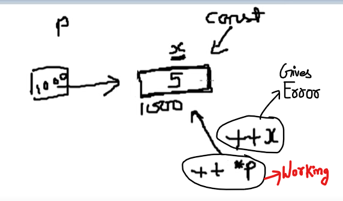
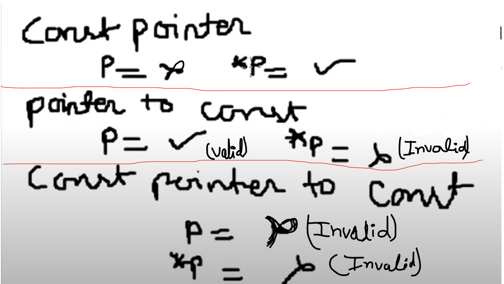
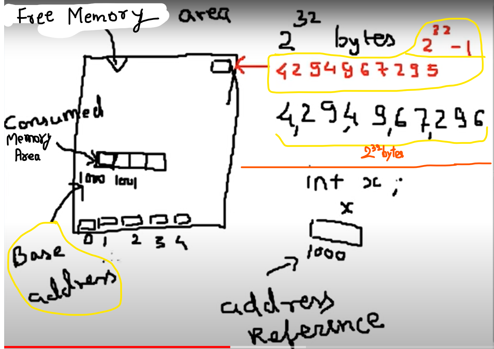
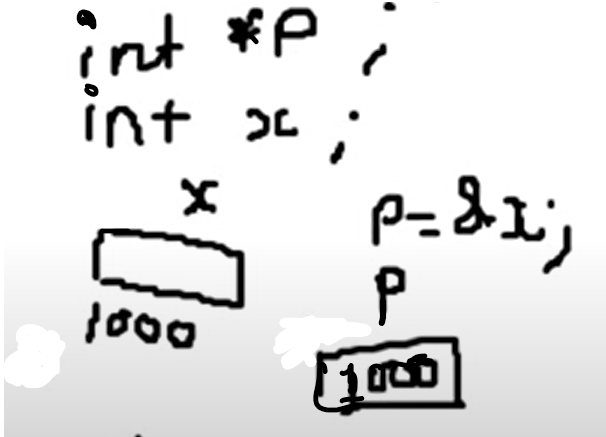
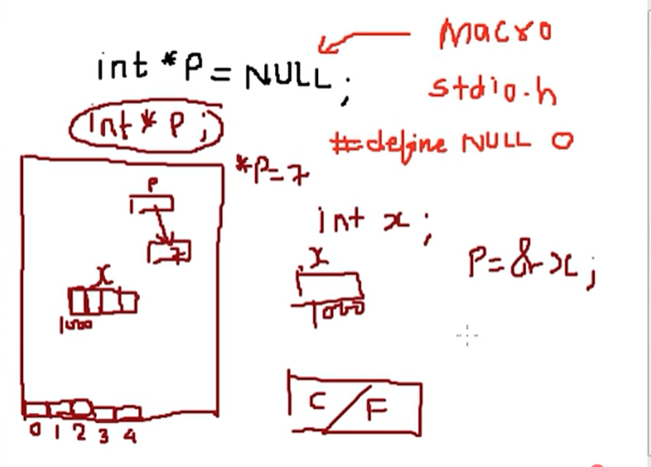
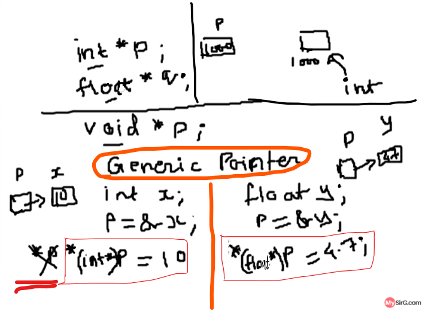
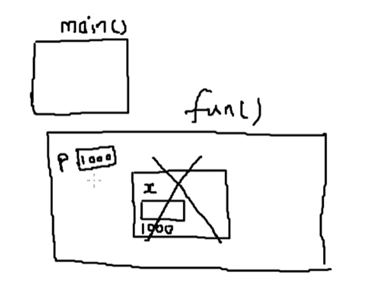
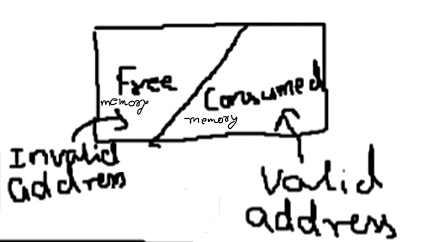
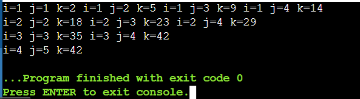
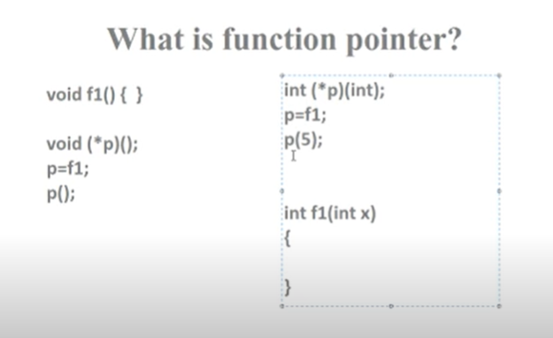

## Lec 81 - const in C

**<u>const</u>**

- const is a keyword in C language

- const is a qualifier

- The qualifier const can be applied to the declaration of any variable to specify that its value will not be changed...


```c
#include<stdio.h>
int main()
{
    const int x=5;
    x++;
    printf("x=%d",x);
}

// Value of x will be constant in all over the program and can't be 
// change....
// But we can break all this rules using pointers...
```


<u>**Historical fact**</u>:

const was not there in early C, the concept is borrowed from C++


**<u>Usages</u>**:

- The keywords const can be applied to any declaration, including those of structures, unions, enumerated types or typedef names...

- Applying it to a declaration is called qualifying the declaration...

- const means that something is not modifiable...


```c
#include<stdio.h>
int main()
{
    const int x = 5;
    printf("x=%d",x);
    x++;
    printf("x=%d",x);
}

// Program will not compile... because of const...
```


```c
#include<stdio.h>
int main()
{
    const int x;
    printf("x=%d",x);
}
// x will give garbage value...
```


```c
#include<stdio.h>
int main()
{
    const int x=5;
    int *p;
    p = &x;
    printf("x=%d\n",x);
    ++(*p);
    printf("x=%d",x); 
}
/* 
Output: 
x = 5 
x = 6
*/
```




--------++++--------

If we want that Pointer can also not change the value then.... 


<u>const pointer</u>    => We can't change value of pointer...

if p will be const pointer then we cann't do p++ (i.e. pointer ke ander change nahi kar sakte the...)


<u>pointer to const</u>    => pointer pointing to a const... we can't do ++*p  (Agar Pointer.. const ko point karega... to pointer ki madad se hum pointer jisko point kar raha hai usme change nahi kar sakte....)


<u>const pointer to const</u>


**<u>Conclusion</u>**:




p => pointer mai kuch assign karna (Valid / Invalid)

*p => Pointer jisko point kar rha hai... usme kuch changes karna (valid / Invalid)


```c
// pointer to const Example:


#include<stdio.h>
int main()
{
    const int x=5;
    const int *p;    // pointer to const
// Pointer mai aap kuch bhi changes kare...lekin pointer jisko point
// kar raha hai usme changes nahi kar sakte...

    p = &x;
// Pointer khud const nahi hai..
// pointer jisko point kar rha hai wo const hai...
    printf("x=%d\n",x);
    ++(*p);
    printf("x=%d",x); 
}


// ++(*p); Shows error in compile... i.e. no any modification because of const...
```


```c

int *p;        // Ordinary Pointer

const int *p;    // pointer to const

int * const p;    //const pointer...
```


    Pointer to const:
    
    const int *p;
    (or)
    int const *p;
    
    Note: int and const are interchangeble...
    


```c
// const pointer Example:

#include<stdio.h>
int main()
    {
        const int x = 5;
        int *const p;    // here p contains garbage value... and 
// get fixed because of const...

        p=&x;    // shows error here because pointer p already
//contains garbage value... and cannot be change...
        printf("x=%d\n",x);
        ++(*p);
        printf("x=%d",x);
}

// shows error here
```


```c
// Solution of previous: const pointer Example contd.


#include<stdio.h>
int main()
    {
        const int x = 5;
        int *const p=&x;    
        // Here p takes the right value not garbage value...
        // i.e. address of x
        printf("x=%d\n",x);
        ++(*p);
        printf("x=%d",x);
}

// x=5 x=6
```

 

```c
// New Example

#include<stdio.h>
int main()
    {
        const int x = 5;
        int *const p=&x;
        printf("x=%d\n",x);
        ++p;    // since p is const cann't change it's vale... //Error
        printf("x=%d",x);
}
// Error
```


```c
// Const pointer to const
// (pointer bhi const hai... aur jisko point karega wo bhi const hai...)


#include<stdio.h>
int main()
    {
        const int x = 5;
        const int *const p=&x;
        printf("x=%d\n",x);
        ++(*p);    //Error
        printf("x=%d",x);
}
```

----------

## Lec 82 - What is Wild Pointer in C


Address of the first bite is known as base addess....






Pointer always takes base address....


At unknown location, data possibly gets write at unknown memory...

Access this address is known as "illegal memory access"...


```c
#include<stdio.h>
int main()
{
    int x;
    int *p; //Uninitialized pointer is called WILD POINTER....
    *p=4;
    p=&x;
}
```

NOTE: pointer p contains Garbage value....

(Agar pointer ke ander kuch assign nahi karenge to wo kehlata hai WILD POINTER...)

------

## Lec 83 - What is NULL Pointer in C

We can solve the WILD POINTER issue using NULL...

- Null is called as Macro...

- macro is made by #define command...    

(In lec Pre-processor Directives, TOPIC- #define)

- Null is decleared in header file.... stdio.h


- #define NULL 0



Memory of the program is divided into two parts:

- Consumed Memory Area

- Free Memory Area

NOTE:- Ratio of both parts changes during execution of the program...


----------

## Lec 84 - What is void pointer in C


void *p;

void represents that it can contain address of block of any type... It doesn't depend on the type....   So that this pointer is called Generic Pointer....





*p is not going to work in the case of void...


we need to use: e.g.:

    *(int *)p = 10;

    *(float *)p = 4.7;


(p jis block ko point kar raha hai usko hum access kar sakte hai... using Type - casting... only in the case of Generic Pointer or Void Pointer...)


-----------

## Lec 85 - What is dangling Pointer in C


```c
#include<stdio.h>
void fun(void);
main()
{
    fun();
}
void fun()
{
    int *p;
    {
        int x;
        p = &x;
            ...(Containg Program)
    }
}
```

After the block finish (i.e. which containing  p=&x;) then the memory of this block get release... But p still exists in the memory...

and p pointer containing the address of the location is not a valid address...(i.e. containg address which is not exist)

So, p will be called as Dangling Pointer...







Solution : 

In the end of the block... Use p = NULL; so that p contains special value which indicates that pointer is not indicating anything...

```c
#include<stdio.h>
void fun(void);
main()
{
    fun();
}
void fun()
{
    int *p;
    {
        int x;
        p = &x;
            ...(Containg Program)
        p = NULL;    //Solution...
    }
}
```

-----------

## Lec 86 - #1 Find output of C program


**<u>Dry Run</u>**:

- Tracing code manually is dry run...


- Dry run needs practice to overcome mistakes in tracing codes


<u>Common mistakes</u>:

- Skipping lines or lncomplete tracing

- Do not pen down variable value updates

- Not tracing the code but tracing what is in your mind

- Reading mistake

- Conceptual mistakes


```c
#include<stdio.h>
int main()
{
    int i,j,k=0;
    for(i=1;i<=3;i++){
    for(j=i;j<=4;j++){
            k=i+j+k;
            printf("i=%d j=%d k=%d ",i,j,k);
            }
        printf("\n");
    }
    printf("i=%d j=%d k=%d",i,j,k);  
}
```




-----------

## Lec 87 - What is function Pointer in C language?




```c
//Example

#include<stdio.h>
int f1(int);    // Function Decleration
main()
{
    int (*p) (int);
    p=f1;
    printf("%d",p(5));
    getch();
}
int f1(int x)
{
    printf("%d ",x);
    return(x+1);
}
```


-----------------------------------------------------**FINISH**----------------------------------------------------------


